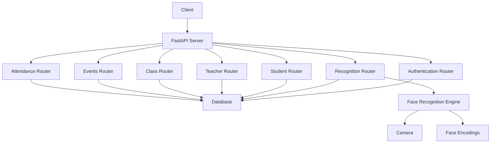
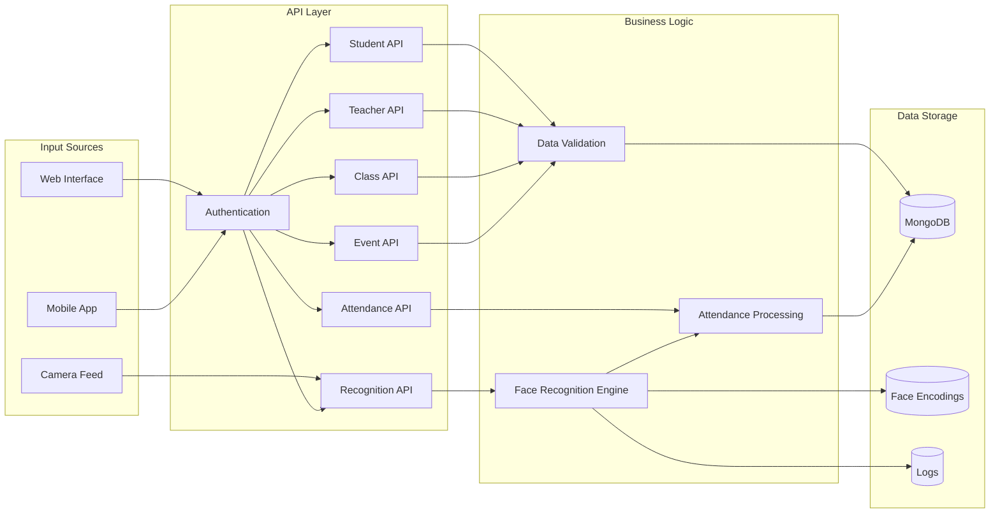
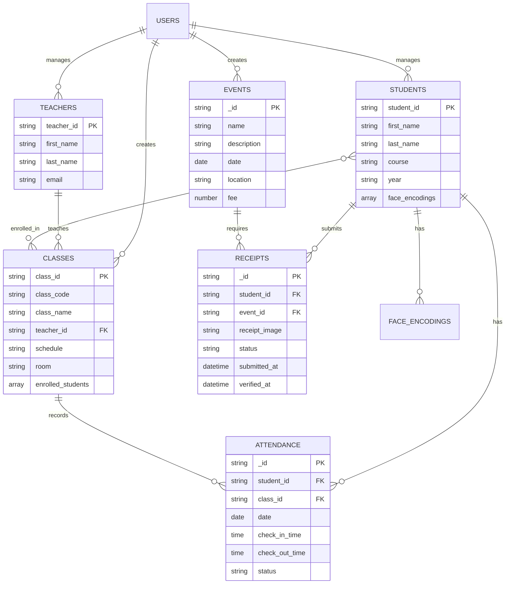

# Face Attendance API Visualization

## API Architecture Overview



## API Endpoints Flow

```mermaid
flowchart TD
    Start([Start]) --> Auth{Authentication Required?}

    Auth -->|Yes| Login[/Login/]
    Auth -->|No| Health[/Health Check/]

    Login --> Token[Get JWT Token]
    Token --> Protected[Protected Endpoints]

    Protected --> Students[Student Management]
    Protected --> Teachers[Teacher Management]
    Protected --> Classes[Class Management]
    Protected --> Events[Event Management]
    Protected --> Attendance[Attendance Management]
    Protected --> Recognition[Face Recognition]

    Students --> S1[Create Student]
    Students --> S2[Get Students]
    Students --> S3[Update Student]
    Students --> S4[Upload Face Data]
    Students --> S5[Get Schedule]
    Students --> S6[Payment Status]

    Teachers --> T1[Create Teacher]
    Teachers --> T2[Get Teachers]
    Teachers --> T3[Update Teacher]
    Teachers --> T4[Delete Teacher]

    Classes --> C1[Create Class]
    Classes --> C2[Get Classes]
    Classes --> C3[Get by Teacher]
    Classes --> C4[Get Courses]
    Classes --> C5[Enroll Student]

    Events --> E1[Create Event]
    Events --> E2[Get Events]
    Events --> E3[Submit Receipt]
    Events --> E4[Verify Receipt]

    Attendance --> A1[Manual Check-in]
    Attendance --> A2[Initialize Class]
    Attendance --> A3[Get Records]
    Attendance --> A4[Analytics]

    Recognition --> R1[Start Recognition]
    Recognition --> R2[Stop Recognition]
    Recognition --> R3[Set Mode]
    Recognition --> R4[Get Status]
    Recognition --> R5[Video Stream]

    R5 --> Camera[Camera Feed]
    R1 --> FaceDetect[Face Detection]
    FaceDetect --> Match[Face Matching]
    Match --> Record[Record Attendance]

    S1 --> DB[(Database)]
    S2 --> DB
    S3 --> DB
    S4 --> DB
    T1 --> DB
    T2 --> DB
    T3 --> DB
    T4 --> DB
    C1 --> DB
    C2 --> DB
    C3 --> DB
    C4 --> DB
    C5 --> DB
    E1 --> DB
    E2 --> DB
    E3 --> DB
    E4 --> DB
    A1 --> DB
    A2 --> DB
    A3 --> DB
    A4 --> DB
    R1 --> DB
    R2 --> DB
    R3 --> DB
    R4 --> DB
```



## Data Flow Diagram



## Entity Relationships



## How to View Interactive API Documentation

Your FastAPI application automatically generates interactive API documentation. To visualize and test the API connections:

1. **Start your FastAPI server:**
   ```bash
   cd face-attendance-backend
   python main.py
   ```

2. **Open Swagger UI:**
   - Go to: `http://127.0.0.1:8000/docs`
   - This provides an interactive interface to explore all endpoints

3. **Open ReDoc:**
   - Go to: `http://127.0.0.1:8000/redoc`
   - This provides a cleaner, more readable documentation

4. **OpenAPI JSON Schema:**
   - Go to: `http://127.0.0.1:8000/openapi.json`
   - Raw JSON specification for import into other tools

## Tools for API Visualization

1. **Postman** - Import the collection I created to test and visualize API flows
2. **Swagger UI** - Built-in with FastAPI at `/docs`
3. **Insomnia** - Alternative to Postman with built-in visualization
4. **Apiary** or **SwaggerHub** - For more advanced documentation
5. **Mermaid Live Editor** - Paste the diagrams above for interactive editing

## Key API Connection Points

- **Authentication Flow:** Login → Get Token → Use in subsequent requests
- **Face Recognition Flow:** Start → Set Mode → Process Camera Feed → Record Attendance
- **Student Management:** Create → Upload Face Data → Enroll in Classes
- **Attendance Tracking:** Initialize Class → Face Recognition → Analytics
- **Event Management:** Create Event → Student Payment → Receipt Verification

This visualization shows how all the API endpoints interconnect and depend on each other to provide the complete face attendance system functionality.
